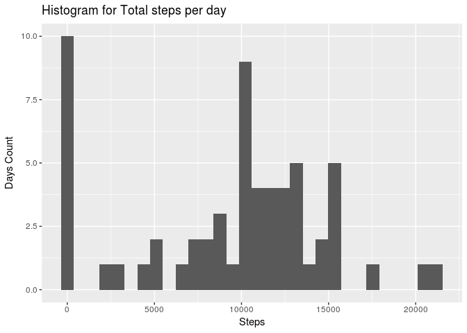
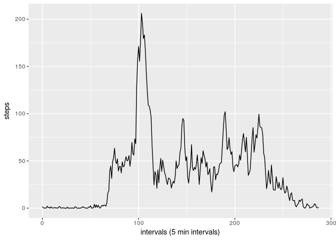
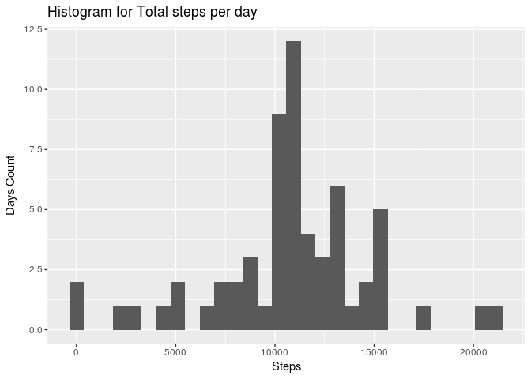
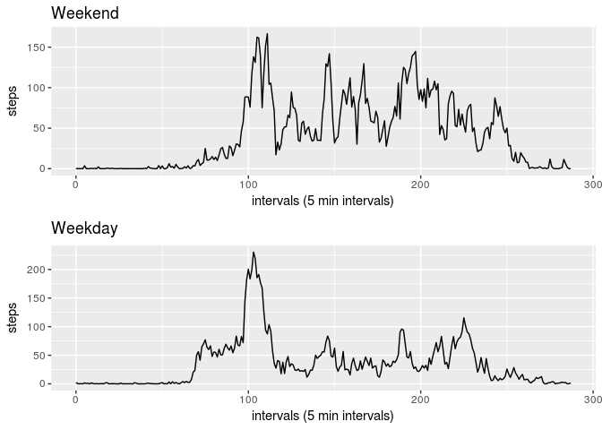

Reproducable Research Week 2 - CP1
=====================

## Loading libraries 
(sorry for the output)


```r
library(dplyr)
```

```
## 
## Attaching package: 'dplyr'
```

```
## The following objects are masked from 'package:stats':
## 
##     filter, lag
```

```
## The following objects are masked from 'package:base':
## 
##     intersect, setdiff, setequal, union
```

```r
library(ggplot2)
library(lubridate)
```

```
## 
## Attaching package: 'lubridate'
```

```
## The following object is masked from 'package:base':
## 
##     date
```

```r
library(gridExtra)
```

```
## 
## Attaching package: 'gridExtra'
```

```
## The following object is masked from 'package:dplyr':
## 
##     combine
```

## Loading and preprocessing the data


```r
activity <- read.csv("./data/activity.csv", stringsAsFactors =FALSE)
activity$date <- as.Date(as.character((activity$date )), "%Y-%m-%d")
str(activity)
```

```
## 'data.frame':	17568 obs. of  3 variables:
##  $ steps   : int  NA NA NA NA NA NA NA NA NA NA ...
##  $ date    : Date, format: "2012-10-01" "2012-10-01" ...
##  $ interval: int  0 5 10 15 20 25 30 35 40 45 ...
```

## What is mean total number of steps taken per day?

### Calculate the total number of steps taken per day


```r
days <- group_by(activity, date)
activity.perday <- summarize(days, steps = sum(steps, na.rm = TRUE) )
head(activity.perday)
```

```
## # A tibble: 6 × 2
##         date steps
##       <date> <int>
## 1 2012-10-01     0
## 2 2012-10-02   126
## 3 2012-10-03 11352
## 4 2012-10-04 12116
## 5 2012-10-05 13294
## 6 2012-10-06 15420
```

### Make a histogram of the total number of steps taken each day


```r
qplot(activity.perday$steps, geom="histogram",  main = "Histogram for Total steps per day", xlab = "Steps", ylab = "Days Count", bins = 30) 
```

<!-- -->

### Calculate and report the mean and median of the total number of steps taken per day

Mean of total steps taken per day


```r
mean(activity.perday$steps)
```

```
## [1] 9354.23
```

Median of total steps taken per day


```r
median(activity.perday$steps)
```

```
## [1] 10395
```

## What is the average daily activity pattern?

Time series plot of the 5 minunte interval and average number of steps taken, averaged across all days:


```r
intervals <- group_by(activity, interval)
activity.perinterval <- summarize(intervals, steps = mean(steps, na.rm = TRUE) )
##ggplot(activity.perinterval, aes(interval, steps)) + geom_line() + xlab("interval (time)") + ylab("average steps")
activity.perinterval <- mutate(activity.perinterval, time = hms(paste(as.character(interval %/% 100), as.character(interval %% 100), "00" , sep=":")))
qplot( as.numeric(time)/300, steps, data = activity.perinterval , geom="line", xlab = 'intervals (5 min intervals)')
```

<!-- -->

```r
## qplot(interval, steps, data = activity.perinterval , geom="line")
```

Which 5-minute interval, on average across all the days in the dataset, contains the maximum number of steps?


```r
arrange(activity.perinterval, desc(steps))[1,1:2]
```

```
## # A tibble: 1 × 2
##   interval    steps
##      <int>    <dbl>
## 1      835 206.1698
```

We see that interval 835 has the most steps on average across all days

## Imputing missing values

How many missing days/intervals are missing (coded as NA) values?


```r
sum(is.na(activity$steps))
```

```
## [1] 2304
```

We will fill the missing values by taking the mean of that interval:


```r
activity.imputed <- activity

activity.imputed <- merge(activity.imputed, activity.perinterval, by = "interval")
name <- "time"
activity.imputed <- activity.imputed %>% select(-one_of(name))
activity.imputed <- rename(activity.imputed, steps = steps.x)
activity.imputed$steps[is.na(activity.imputed$steps)] <- as.integer(activity.imputed$steps.y[is.na(activity.imputed$steps)])
name <- "steps.y"
activity.imputed <- activity.imputed %>% select(-one_of(name))
activity.imputed <- arrange(activity.imputed,date)
head(activity.imputed)
```

```
##   interval steps       date
## 1        0     1 2012-10-01
## 2        5     0 2012-10-01
## 3       10     0 2012-10-01
## 4       15     0 2012-10-01
## 5       20     0 2012-10-01
## 6       25     2 2012-10-01
```

A histrogram of the total number of steps taken each day


```r
days.imputed <- group_by(activity.imputed, date)
activity.imputed.perday <- summarize(days.imputed, steps = sum(steps, na.rm = TRUE) )
qplot(activity.imputed.perday$steps, geom="histogram",  main = "Histogram for Total steps per day", xlab = "Steps", ylab = "Days Count", bins = 30) 
```

<!-- -->

Mean total number of steps taken per day


```r
mean(activity.imputed.perday$steps)
```

```
## [1] 10749.77
```

Median total number of steps taken per day


```r
median(activity.imputed.perday$steps)
```

```
## [1] 10641
```

We see that imputing missing data slightly increased the estimates of total number of steps taken.

## Are there differences in activity patterns between weekdays and weekends?

We will create a factor variable 'day.type' in the dataset indicating if it's a weekday or weekend


```r
activity.imputed = mutate(activity.imputed, day.name = weekdays(activity.imputed$date), day.type = as.factor(ifelse(day.name %in% c("zaterdag", "zondag"), "weekend", "weekday")))
name <- "day.name"
activity.imputed <- activity.imputed %>% select(-one_of(name))
head(activity.imputed)
```

```
##   interval steps       date day.type
## 1        0     1 2012-10-01  weekday
## 2        5     0 2012-10-01  weekday
## 3       10     0 2012-10-01  weekday
## 4       15     0 2012-10-01  weekday
## 5       20     0 2012-10-01  weekday
## 6       25     2 2012-10-01  weekday
```

Now we will make a plot comparing activity between weedays and weekend


```r
activity.weekend <- subset(activity.imputed, ! day.type %in% c("weekday"))
intervals.weekend <- group_by(activity.weekend, interval)
activity.weekend.perinterval <- summarize(intervals.weekend, steps = mean(steps, na.rm = TRUE) )
activity.weekend.perinterval <- mutate(activity.weekend.perinterval, time = hms(paste(as.character(interval %/% 100), as.character(interval %% 100), "00" , sep=":")))

activity.weekday <- subset(activity.imputed, ! day.type %in% c("weekend"))
intervals.weekday <- group_by(activity.weekday, interval)
activity.weekday.perinterval <- summarize(intervals.weekday, steps = mean(steps, na.rm = TRUE) )
activity.weekday.perinterval <- mutate(activity.weekday.perinterval, time = hms(paste(as.character(interval %/% 100), as.character(interval %% 100), "00" , sep=":")))

plot1 <- qplot( as.numeric(time)/300, steps, data = activity.weekend.perinterval , geom="line", xlab = 'intervals (5 min intervals)', main = "Weekend")
plot2 <- qplot( as.numeric(time)/300, steps, data = activity.weekday.perinterval , geom="line", xlab = 'intervals (5 min intervals)', main = "Weekday")
grid.arrange(plot1, plot2, nrow=2, ncol=1)
```

<!-- -->

It seems that that activity start earlier on weekdays (prepping for work?) than in the weekend. During the rest of the day there's more activity in the weekend.

